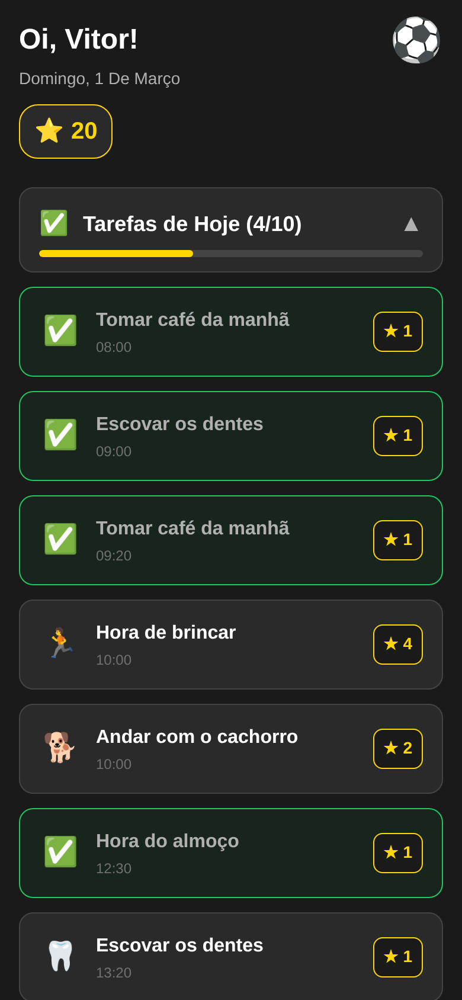
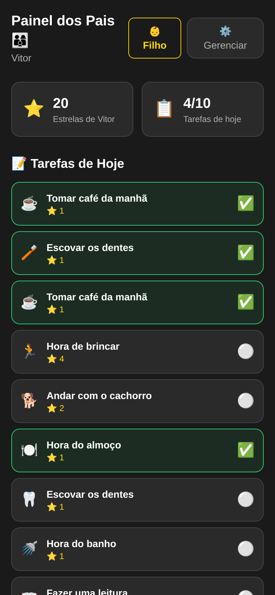
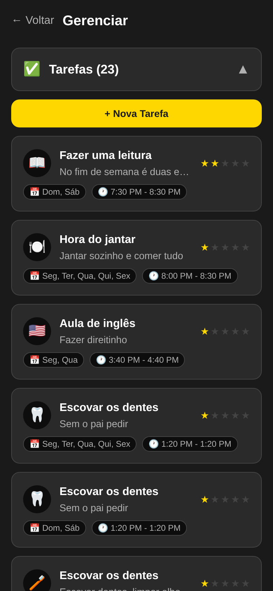
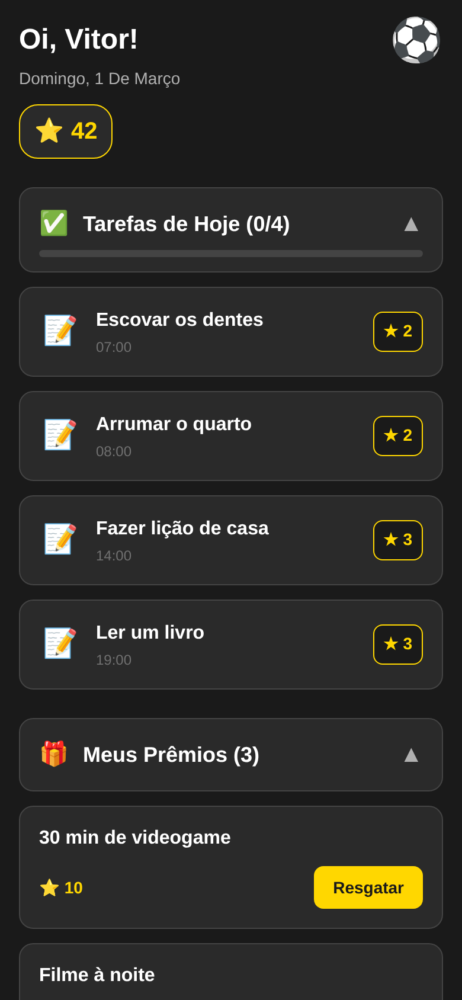
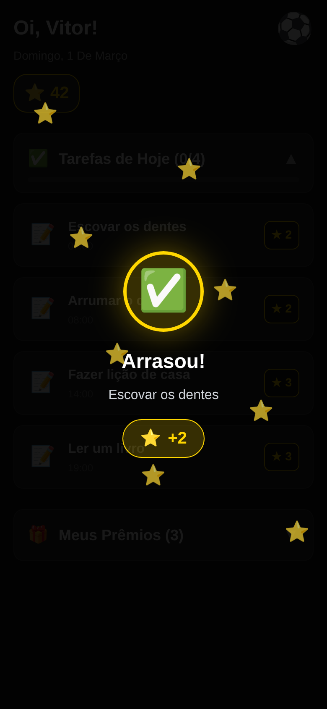

# Rotina do Atleticano ⭐

A self-hosted routine and reward app for kids, themed around Atlético Mineiro (Galo).

## Screenshots

| Child | Parent | Manage |
|:---:|:---:|:---:|
|  |  |  |

| Rewards | Celebration | Galo News |
|:---:|:---:|:---:|
|  |  |  |

---

## What is this?

A daily routine tracker where a child completes tasks to earn stars ⭐, then redeems stars for rewards. Parents approve completions and redemptions. The whole thing is wrapped in an Atlético Mineiro theme — completing your day feels like winning a match.

Built for one family. Not a SaaS product.

---

## Features

- **Child view** — today's task list, star balance, reward redemption. After each task: celebration animation + Galo news card (upcoming matches, recent headlines)
- **Parent view** — approve or reject task completions and reward redemptions
- **Manage view** — add/edit tasks and rewards; one-tap add for AI-suggested Galo rewards (stadium tickets, TV game nights, static prizes)
- **PIN guard** — triple-tap the Galo badge to switch from child → parent; PIN entry to switch back
- **Real-time sync** — SSE-based invalidation; all connected devices update instantly on any write
- **PWA** — installable, fullscreen standalone on mobile

---

## Repo structure

```
galo-routine/
├── frontend/        React + Vite + Tailwind PWA
├── backend/         Express + SQLite API (port 3200)
├── scripts/         Cron scripts and one-off utilities
├── screenshots/     App screenshots for this README
├── deploy.sh        Build frontend + copy to /var/www/
├── .env             Runtime config (gitignored)
└── .env.example     Config template
```

---

## Architecture

```
┌──────────────────────────────────────────────┐
│  Browser (React + Vite + Tailwind + PWA)      │
│                                               │
│  /child  /parent  /parent/manage              │
│                                               │
│  Zustand stores  ←  SSE invalidation stream  │
└────────────────────┬─────────────────────────┘
                     │ HTTP + SSE (/api/*)
              Apache reverse proxy
                     │
┌────────────────────▼─────────────────────────┐
│  backend/ (Express, port 3200)                │
│                                               │
│  /api/tasks  /api/completions  /api/rewards   │
│  /api/redemptions  /api/family  /api/periods  │
│  /api/galo/schedule  /api/galo/news-state     │
│                                               │
│  SQLite (better-sqlite3, WAL mode)            │
│  SSE /api/events — broadcasts on writes       │
└──────────────────────────────────────────────┘
                     ↑
         scripts/galo-matches.mjs (daily cron)
         ESPN API + Google News RSS
```

---

## Tech Stack

**Frontend (`frontend/`)**
- React 18 + TypeScript + Vite
- Tailwind CSS — Galo theme (`galoBlack: #1A1A1A`, `starGold: #FFD700`)
- React Router v6
- Zustand — global state (auth, tasks, completions, rewards)
- Firebase — Google sign-in only (no Firestore)
- PWA — `manifest.json` + Vite build

**Backend (`backend/`)**
- Express + better-sqlite3 (WAL mode)
- SSE for real-time push
- Systemd service: `galo-routine.service`

---

## Screens

| Route | Who | What |
|---|---|---|
| `/login` | Both | Google sign-in |
| `/register` | Parent | First-time family setup |
| `/child` | Child | Today's tasks + stars + rewards |
| `/parent` | Parent | Approve completions + redemptions |
| `/parent/manage` | Parent | Add/edit tasks, rewards, Galo suggestions |
| `/parent-pin` | Both | PIN entry to switch to parent role |

Default entry is `/child`. Parent access requires PIN.

---

## Setup

### 1. Clone

```bash
git clone https://github.com/andrepaim/galo-routine.git
cd galo-routine
```

### 2. Configure

```bash
cp .env.example .env
# Edit .env and set FAMILY_ID and DB_PATH

# Also set VITE_FAMILY_ID in the frontend env:
echo "VITE_FAMILY_ID=your-family-id" >> frontend/.env
```

### 3. Backend

```bash
cd backend
npm install
node src/index.js   # http://127.0.0.1:3200
```

### 4. Frontend (dev)

```bash
cd frontend
npm install
npm run dev         # http://localhost:5174
```

### 5. Deploy (production)

```bash
bash deploy.sh
```

Builds the frontend and copies `dist/` → `/var/www/rotinadoatleticano/`.

---

## Production (systemd)

The backend runs as a persistent service:

```bash
systemctl status galo-routine.service
systemctl restart galo-routine.service
```

Service file example:

```ini
[Unit]
Description=Galo Routine API
After=network.target

[Service]
Type=simple
WorkingDirectory=/path/to/galo-routine/backend
ExecStart=/usr/bin/node src/index.js
Restart=always
RestartSec=5
Environment=NODE_ENV=production
EnvironmentFile=/path/to/galo-routine/.env

[Install]
WantedBy=multi-user.target
```

---

## Galo Integration

A daily cron (`scripts/galo-matches.mjs`, 08:00 BRT) fetches:

1. **Upcoming fixtures** via ESPN public API — Brasileirão, Libertadores, Sul-Americana (no key needed)
2. **Recent news** via Google News RSS (`q=Atletico+Mineiro`, last 3 days)
3. Builds **suggested rewards** for the Manage screen:
   - 🏟️ Next home match at Arena MRV (100⭐, dynamic)
   - 📺 Next weekday night game ≥ 19:00 BRT (25⭐, dynamic)
   - 🎮 2h de FIFA (15⭐), 🕹️ 1h videogame (10⭐), 👕 Camisa do Galo (80⭐)

After a task is completed, the child sees a `GaloCelebration` animation, then a `GaloNewsCard` with the next unseen headline or fixture. Seen IDs are tracked so nothing repeats.

A Telegram alert fires if the next home match is within 7 days.

---

## Scripts

| Script | What it does |
|---|---|
| `scripts/galo-matches.mjs` | Daily cron — ESPN + News → backend; Telegram alert if home match ≤ 7 days |
| `scripts/import-tasks-admin.mjs` | One-shot admin import of the full task list |
| `scripts/migrate-from-firebase.mjs` | One-shot migration from Firebase Firestore to SQLite |

---

## Apache Proxy

```apache
ProxyPreserveHost On
ProxyPass /api/ http://127.0.0.1:3200/api/
ProxyPassReverse /api/ http://127.0.0.1:3200/api/
```

---

## No blue. Cruzeiro is the arch-rival. The theme is black and gold, always.
